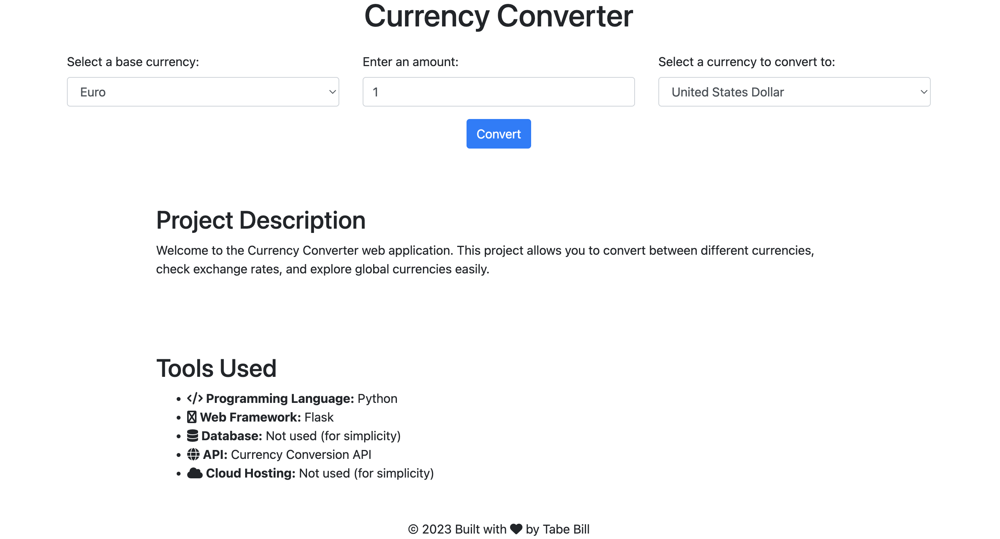

# Currency Converter

Welcome to the Currency Converter web application! This project allows you to easily convert between different currencies, check exchange rates, and explore global currencies



## Table of Contents

- [Features](#features)
- [Getting Started](#getting-started)
  - [Prerequisites](#prerequisites)
  - [Installation](#installation)
- [Usage](#usage)
- [Project Description](#project-description)
- [Tools Used](#tools-used)
- [Contributing](#contributing)
- [License](#license)


## Features

- Convert between various currencies.
- Check exchange rates in real-time.
- User-friendly web interface.
- Responsive design for mobile and desktop.

## Getting Started

### Prerequisites

- Python: Ensure you have Python installed. You can download it from [python.org](https://www.python.org/downloads/).

- Create and initialize a virtual environment for best practices
   ```bash
   python -m venv venv
   source venv/bin/activate

### Installation

1. Clone the repository:

   ```bash
   git clone https://github.com/tabeb/currency-converter.git](https://github.com/tabebill/python-projects.git
   cd currency-converter

   
2. Install required Python packages:

   ```bash
   pip install -r requirements.txt


3. Sign up for a free API key from a currency conversion service provider.
Update the API_KEY variable in the app.py file with your API key.
Run the application:

   ```bash
   python app.py

The web application should now be running locally at http://localhost:5000.


## Usage

Access the Currency Converter web application in your web browser at http://localhost:5000.

Select a base currency, enter an amount, and choose the currency to convert to.

Click the "Convert" button to see the converted amount and exchange rate.

## Project Description

The Currency Converter project is a web application built with Flask that allows users to perform currency conversions and check exchange rates between different currencies. It serves as a simple and user-friendly tool for handling currency-related tasks.

## Tools Used

Programming Language: Python

Web Framework: Flask

API: Currency Conversion API

Frontend: HTML, CSS, JavaScript

Icon Library: Font Awesome

## Contributing
Contributions to this project are welcome! If you have ideas for improvements or new features, feel free to fork the repository, make your changes, and submit a pull request.

## License
This project is licensed under the GPL License. See the [LICENSE](https://github.com/collective/example.p4p5/blob/master/LICENSE.GPL) file for details.
